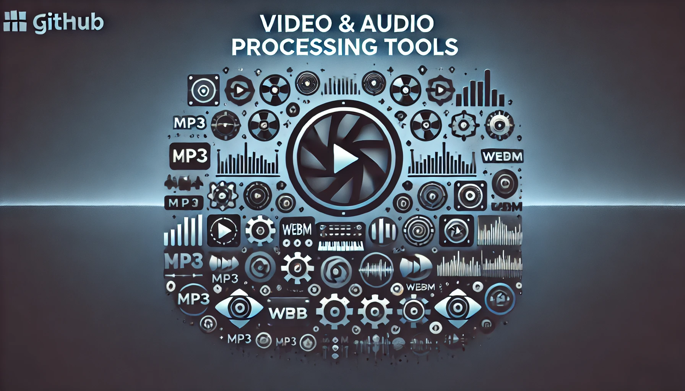

[<< Back to tools index](https://kbnlwikimedia.github.io/tools/index.html)

# A collection of video and audio processing tools

## Description
This repo performs various operations on video and audio files, including:
1. Extracting short video clips from longer ones.
2. Enhancing audio by adjusting pitch and volume, eg. for a deeper voice.
3. Compressing and converting video files to WebM format.
4. Extracting audio from a video and saving it as an MP3 file.
5. Amplifying audio if necessary.
6. Transcribing audio using Whisper.
7. Correcting raw audio transcripts using ChatGPT.
8. Embedding subtitles into the WebM video files.

## Main Functions
- Extract video clips.
- Enhance audio in a video file.
- Convert video to WebM format for web optimization.
- Convert audio to MP3 and amplify it.
- Transcribe audio using Whisper.
- Correct transcripts using AI (ChatGPT).
- Add subtitles to videos.

The main file of this repo is [runtools.py](https://github.com/ookgezellig/videotools/blob/main/runtools.py). In this file, (un)comment the functions you want execute.

## Requirements
- FFmpeg for video/audio processing. It must be installed on your machine and added to the PATH variable
- OpenAI API (Whisper and ChatGPT models) for transcription and transcript correction.
- Set OpenAI API key for ChatGPT in the [.env](https://github.com/ookgezellig/videotools/blob/main/.env) file. Whisper can be run without API key

## Demo
Using this toolkit, an mp4-video has been converted into the following products: 
- A [WebM video](https://commons.wikimedia.org/wiki/File:Wikidata_Workshop_-_Theoretical_part_-_Maastricht_University_-_15_October_2024.webm). In this video, the sound volume has been amplified and the voice of the speaker has been made lower/deeper. Also the file size of the webm is about 10 times smaller than the orginal mp4.
- A full text audio transcript (.txt) has been generated. It has been embedded in the video description. This was done using Whisper with ChatGPT post-corrections.
- [Closed captions / subtitles](https://commons.wikimedia.org/wiki/TimedText:Wikidata_Workshop_-_Theoretical_part_-_Maastricht_University_-_15_October_2024.webm.en.srt)  in English were also generated. This was done using Whisper with ChatGPT post-corrections.

## Articles
* [How to create high-quality offline video transcriptions and subtitles using Whisper and Python](https://ookgezellig.github.io/videotools/stories/How%20to%20create%20high-quality%20offline%20video%20transcriptions%20and%20subtitles%20using%20Whisper%20and%20Python.html) and [same article on Zenodo](https://doi.org/10.5281/zenodo.14047913), 6 November 2024

## Info
* Latest update: 6 November 2024
* Author: Olaf Janssen (ookgezellig) - Supported by ChatGPT
* License: Creative Commons CC0 - [http://creativecommons.org/publicdomain/zero/1.0](http://creativecommons.org/publicdomain/zero/1.0)
